# Meso

A professional-grade desktop weather application for Fedora Linux, written in Rust.
Inspired by the [wX Android app](https://gitlab.com/joshua.tee/wx/), targeting weather
enthusiasts and professionals who know what they're looking for.

## Features

- **Radar** — NEXRAD Level 2 (super-res reflectivity & velocity, multi-tilt) + full Level 3 product suite; dual-pane mode; warnings/storm-track overlays; pan/zoom; animation
- **Satellite** — GOES East/West imagery across all ABI bands and sectors (CONUS, Mesoscale, Full Disk); pan/zoom; animation
- **Alerts** — Active NWS watches, warnings & advisories with color-coded severity
- **Forecast** — 7-day NWS forecast + current surface observations (METAR/TAF) for any location
- **Soundings** — Upper-air sounding viewer (Skew-T) for all NWS rawinsonde sites
- **National Products** — WPC surface analysis, QPF, NHC tropical outlooks, upper-air analysis
- **Models** — SREF, NAM, GFS, RAP, HRRR output via NCEP MAG; animation with local timestamps
- **SPC** — Mesoscale analysis products with zoom/pan
- **meso-updraft** — Optional background daemon that pre-caches subscribed products

### Feature gallery

**Radar Level 2** — High-resolution base radar view for operational storm interrogation.
[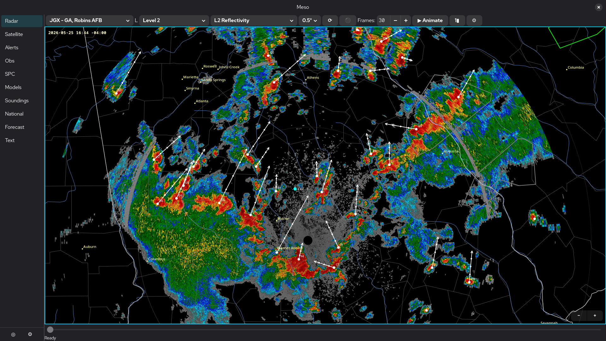](media/features/1_radar_level2.png)

**Radar Dual-Pane** — Compare complementary radar fields side-by-side for faster decision-making.
[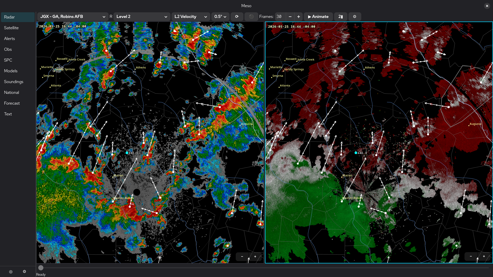](media/features/3_radar_dual_pane.png)

**Radar Dual-Pol** — Dual-polarization products help diagnose precipitation type and storm structure.
[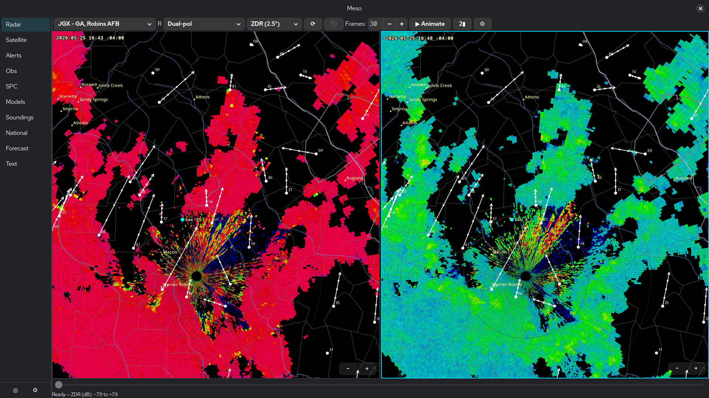](media/features/2_radar_dual_pol.png)

**Satellite** — GOES imagery with sector and band selection for cloud and moisture analysis.
[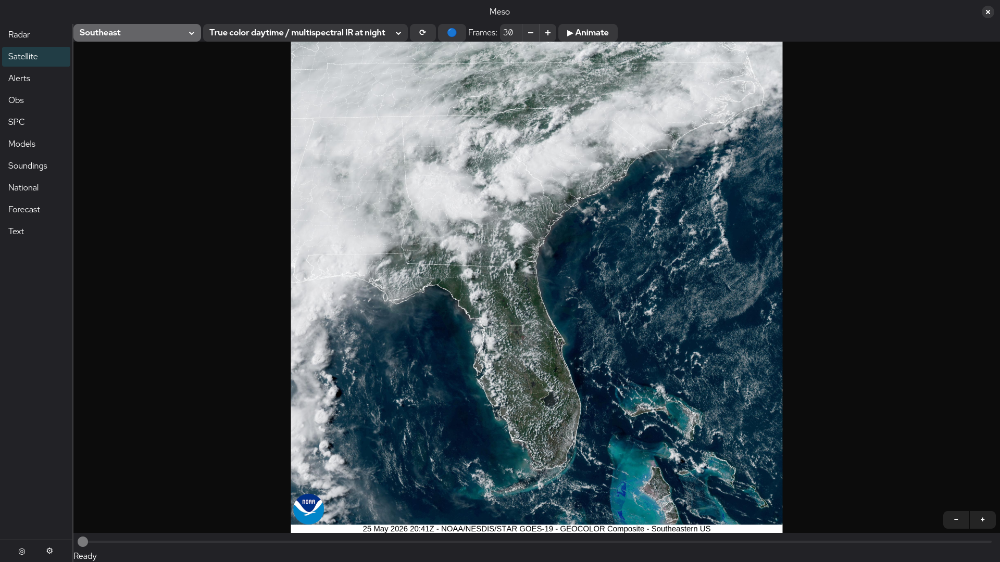](media/features/4_satellite.png)

**Alerts** — Active NWS watches, warnings, and advisories with clear severity emphasis.
[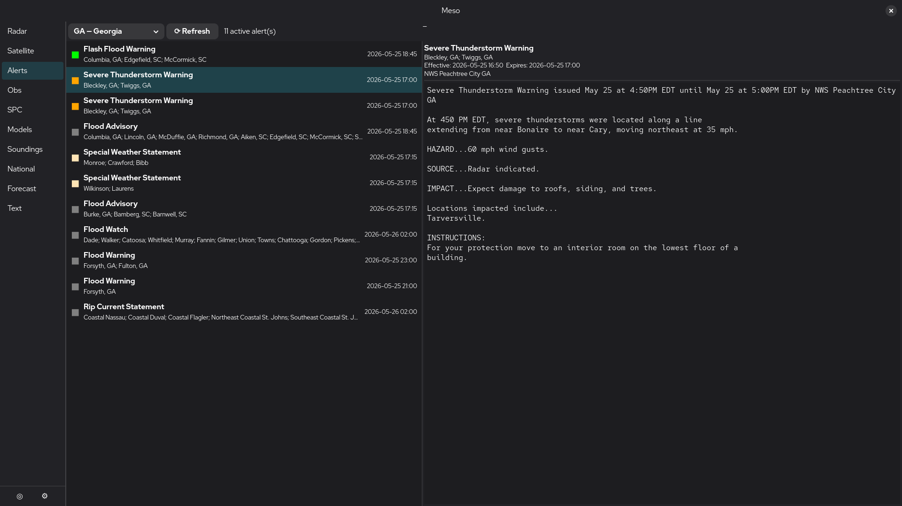](media/features/5_alerts.png)

**Observations and TAFs** — Surface observations and terminal forecasts in one quick operational view.
[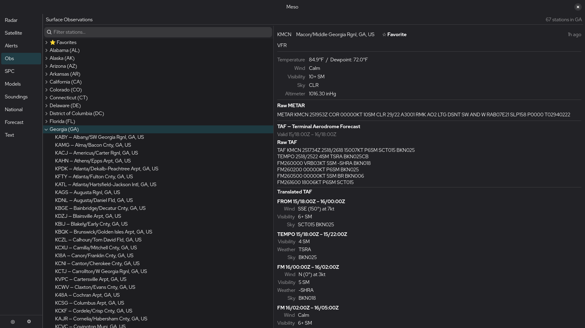](media/features/6_obs_and_tafs.png)

**SPC Overviews** — Convective outlook and severe-weather context directly from SPC products.
[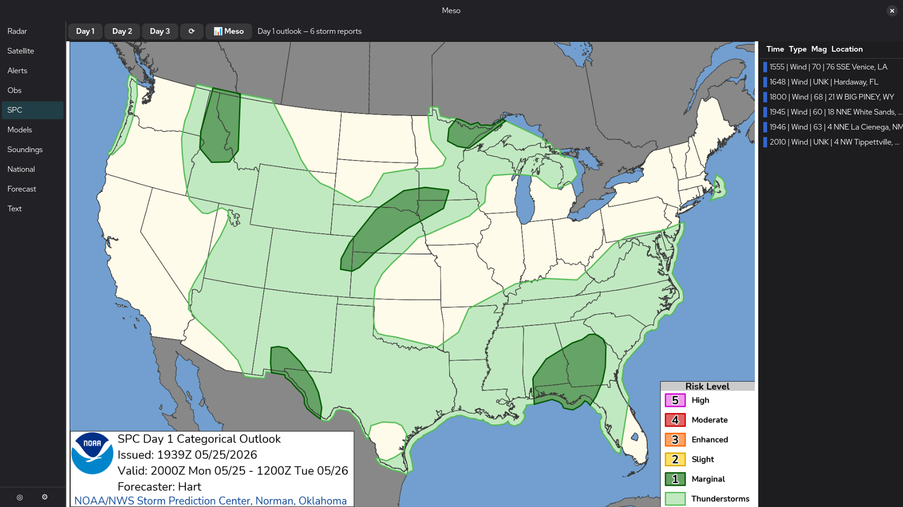](media/features/7_spc_overviews.png)

**SPC Mesoanalysis** — Mesoscale environmental fields for real-time severe-weather diagnosis.
[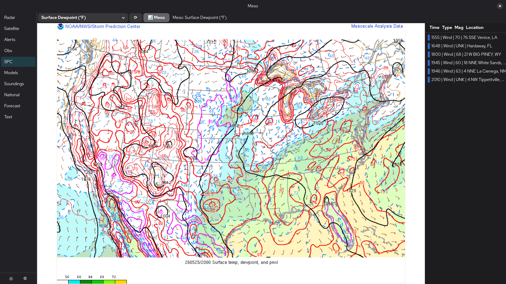](media/features/8_spc_mesoanalysis.png)

**SREF Ensemble Models** — Ensemble guidance to assess spread and forecast confidence.
[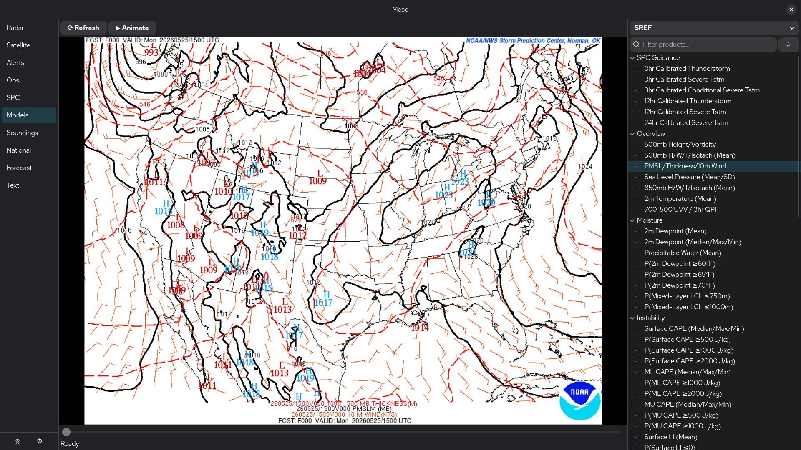](media/features/9_models_sref_ensemble.png)

**NCEP Models** — Broad model product access with local timestamps and animation support.
[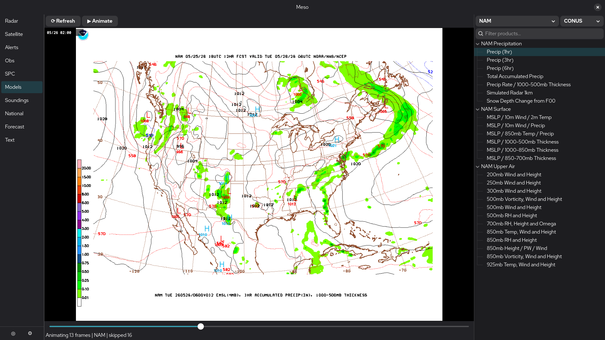](media/features/10_models_ncep.png)

**Soundings** — Skew-T and upper-air profile tools for stability and shear analysis.
[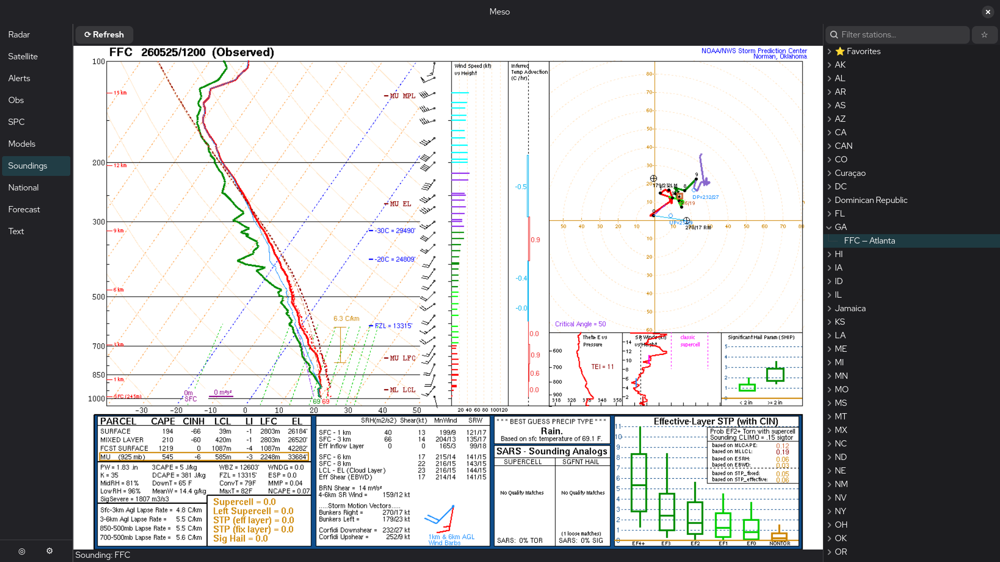](media/features/11_soundings.png)

**National Products** — WPC, NHC, and related national guidance in a dedicated pane.
[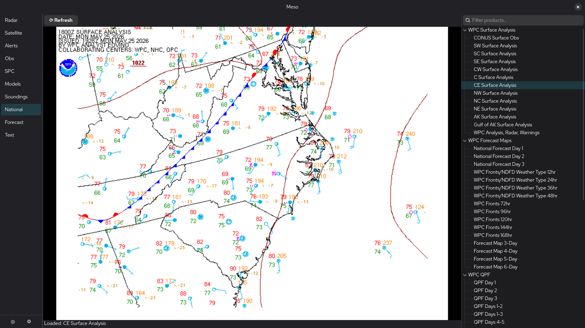](media/features/12_national_products.png)

**Local 7-Day Forecast** — Extended point forecast summary for planning and trend awareness.
[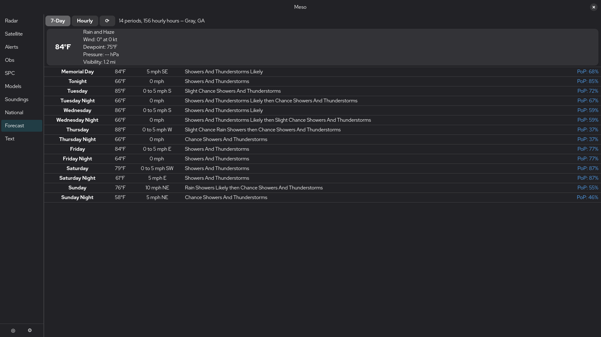](media/features/13_local_7day.png)

**Local Hourly Forecast** — Hour-by-hour forecast detail for short-fuse decisions.
[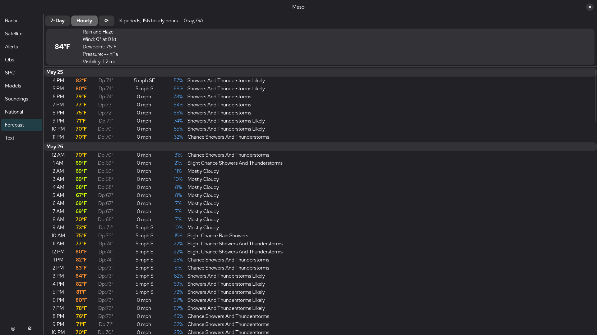](media/features/14_local_hourly.png)

**Text Products** — Fast access to NWS text bulletins and office-issued discussions.
[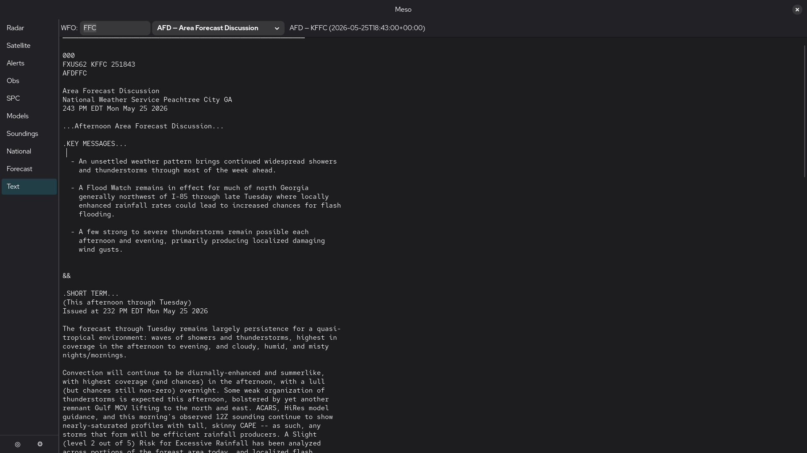](media/features/15_text_products.png)

---

## Dependencies

### Fedora

```bash
sudo dnf install gtk4-devel libadwaita-devel
```

> These are the only non-Rust build-time requirements. All Rust crates are
> fetched automatically by Cargo.

### Rust toolchain

Rust **1.75 or newer** is required. If you don't have it:

```bash
curl --proto '=https' --tlsv1.2 -sSf https://sh.rustup.rs | sh
```

---

## Building

```bash
git clone https://github.com/JacobCallahan/meso
cd meso
cargo build --release
```

The main application binary is placed at `target/release/meso`.
The background daemon binary is placed at `target/release/meso-updraft`.

For a quick development build:

```bash
cargo build
./target/debug/meso
```

---

## Running

```bash
./target/release/meso
```

To enable verbose logging:

```bash
RUST_LOG=info ./target/release/meso
RUST_LOG=debug ./target/release/meso   # very noisy
```

Meso requires a running Wayland or X11 display session.

---

## Configuration

All settings are accessible from the in-app **Settings** panel (gear icon in the
toolbar). Configuration is persisted automatically when you close the application.

The config file lives at `~/.config/Meso/config.toml` if you ever need to inspect
or reset it by hand (do so while the app is not running).

Key settings areas in the Settings panel:

- **Radar** — reflectivity/velocity color palettes, animation frame count
- **Satellite** — animation frame count, default sector and band
- **Locations** — named lat/lon points used for forecasts and alerts
- **Rendering** — GPU toggle (wgpu vs. Cairo CPU fallback)
- **Cache** — per-type retention durations; "Clear All Cache" button
- **Updraft** — background daemon toggle, wake interval, subscription manager

---

## meso-updraft (background caching daemon)

`meso-updraft` is an optional lightweight daemon that periodically fetches and
caches your subscribed radar and satellite products in the background — even when
the main application is closed. When you open Meso, your data is already there.

### Subscribing to products

In the **Radar** or **Satellite** pane toolbar, click the **⚫** button (to the
right of ⟳ Refresh) to subscribe to the currently selected station/product or
sector/band. The button turns **🔵** when subscribed. Click again to unsubscribe.

To view and manage all current subscriptions, open **Settings → Updraft Settings…**.

### Enabling the daemon

1. Toggle **"Enable meso-updraft background caching"** in **Settings → Updraft**.
2. Optionally adjust the wake interval (default: 5 minutes).

The toggle controls whether the daemon does work on each wake — the daemon process
itself must be running separately (see below).

### Running as a systemd user service (recommended)

A service unit template is provided at `data/meso-updraft.service`.

```bash
# Install the binary
cp target/release/meso-updraft ~/.local/bin/

# Install the unit file
cp data/meso-updraft.service ~/.config/systemd/user/

# Enable and start
systemctl --user daemon-reload
systemctl --user enable --now meso-updraft

# Check status / logs
systemctl --user status meso-updraft
journalctl --user -u meso-updraft -f
```

The daemon re-reads its configuration and subscriptions on every wake cycle, so
no restart is needed after changing settings or subscriptions in Meso.

### Running manually (one-shot or testing)

```bash
RUST_LOG=meso_updraft=info ./target/release/meso-updraft
```

---

## Data sources

All data is fetched live from NOAA/NWS public servers; no API key is required.

| Data                | Source                                            |
|---------------------|---------------------------------------------------|
| Level 2 radar       | NOMADS (`nomads.ncep.noaa.gov`)                   |
| Level 3 radar       | TGFTP (`tgftp.nws.noaa.gov`)                      |
| GOES satellite      | NESDIS (`cdn.star.nesdis.noaa.gov`)               |
| Watches/warnings    | NWS API (`api.weather.gov`)                       |
| Forecast            | NWS API (`api.weather.gov`)                       |
| Soundings           | SPC (`www.spc.noaa.gov/exper/soundings/`)         |
| National products   | WPC / NHC / OPC                                   |
| Model output        | NCEP MAG (`mag.ncep.noaa.gov`)                    |
| SPC mesoanalysis    | SPC (`www.spc.noaa.gov/`)                         |

An active internet connection is required.

---

## License

GPL-3.0-or-later — see [LICENSE](LICENSE).
